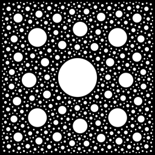
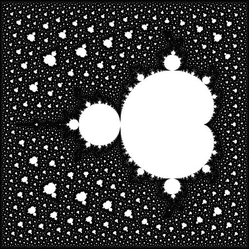

Note: this is a subject of ongoing research, no stability guarantees are made.  

You can read this paper for introduction: 
[Paul Bourke - Random space filling of the plane (2011)](http://paulbourke.net/fractals/randomtile/).  
However, the provided search algorithm for the next location is inefficient, 
and offers very limited control over the distribution[[1]](#footnote_1).
In this work, I present two solvers for the following equation:   
  
**sdfn** are signed distance functions (primitives), by aggregate minima forming together a complex distance field - further denoted **"SDF"**.

The goal of algorithm lies in finding a safe domain, guaranteed to not intersect with any shapes.
A generic and parallel interface was implemented. Currently supported:
- User-defined distributions (including fractal and random)
- Any shapes which can be represented with SDF: curves, regular polygons, non-convex and disjoint areas, fractals or any sets with non-integer hausdorff dimension (as long as the distance can be approximated).

### Argmax2D
SDF is stored as a discrete bitmap, with memory layout reminiscent of z-order curve. Solver is guaranteed to always find **global maxima**, but increasing precision requires quadratic memory.

### GD-ADF
A paper "Adaptively Sampled Distance Fields" (doi:[10.1145/344779.344899](https://dl.acm.org/doi/10.1145/344779.344899)) offered an idea of reducing memory consumption, however it was very elaborate to not include _any_ hints for a practical implementation. The only one being - using polynomial approximations for every node of the k-d tree; however, current work takes a different path - by storing function primitives themselves in each node (bucket). Redundant primitive elimination within a bucket was performed using [interior-point method](https://en.wikipedia.org/wiki/Interior-point_method).  
ADF itself implements SDF trait, allowing for complex fields composed of millions of primitives to be sampled efficiently — as opposed to computing it directly — with quadratic complexity in nature.  
However, primitive elimination is not yet perfect. An elimination algorithm which is both precise and fast enough will be a subject of further theoretical research.

Once the representation is obtained, the role of optimizer takes place. For practical purposes, gradient descent with exponential convergence has been chosen — making GD-ADF a **local maxima** algorithm; as described by following equation:  
  
Since by definition, first order derivative of distance field is constant, only direction of the gradient is considered — eliminating a number of issues with both GD/IPM; and as a bonus, rendering them to be no longer dependent on the field magnitude directly.

Unlike Argmax2D, GD-ADF offers 10-100x memory reduction, as well as  continuous, exact field representation. Various speed tradeoffs are provided, including both single and double float precision.

## Examples
You can run examples with following command:  
`cargo run --release --features "drawing" --example <example name>`  
You can add `-- -C target-cpu=native` at the command end to further improve the speed.

[`01_fractal_distribution`](examples/argmax2d/01_fractal_distribution.rs)  
Each subsequent circle is inserted at the maxima of distance field.  

[`02_random_distribution`](examples/gd_adf/02_random_distribution.rs)  
Given `(xy, magnitude)` of the maxima, a new random circle is inserted within a domain of radius `magnitude` and center `xy`.     

[`03_embedded`](examples/argmax2d/03_embedded.rs)   
A distribution embedded in a distribution.  
 

[`04_polymorphic`](examples/gd_adf/04_polymorphic.rs)  
Showcasing:
- Dynamic dispatch interface;
- Random distribution of mixed shapes;
- Random color and texture fill style;
- Parallel generation and drawing.

[`05_image_dataset`](examples/argmax2d/05_image_dataset.rs)  
Display over 100'000 images.  
Run with `cargo run --release --features "drawing" --example image_dataset -- "<image folder>" -C target-cpu=native`  

[`06_custom_primitive`](examples/gd_adf/06_custom_primitive.rs)  
A user-defined primitive.  

## Past work
In `src/legacy` you can find numeruos algorithms which are worth re-exploring, including quadtree and GPU implementations. 

## Future work
- [x] Add more sample SDFs, and generic draw trait
- [x] Extend to support precision below 2-16 (gigapixel resolution)
- [x] Rework traits
- [ ] Generalize to N dimensions

Once above are done, I will use this library for my next project "Gallery of Babel".

#### Footnotes
<a id="footnote_1">[1]</a>: J. Shier, "A Million-Circle Fractal": [https://www.d.umn.edu/~ddunham/circlepat.html](https://www.d.umn.edu/~ddunham/circlepat.html)  
&laquo;...Run time was 14.7 hours.&raquo;
